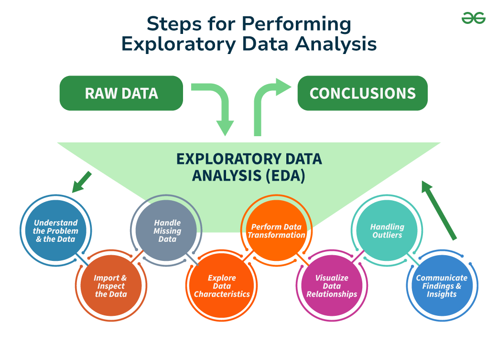

# Exploratory Data Analysis (EDA) Case Studies

## 🔍 What is Exploratory Data Analysis (EDA)?

Exploratory Data Analysis is the process of analyzing datasets to summarize their key characteristics, often using visual methods. It helps uncover patterns, detect anomalies, test assumptions, and gain insights before formal modeling.

EDA is a crucial step in any data science or analytics workflow.

## 🧠 Purpose of EDA

- Understand the **structure**, **distribution**, and **relationships** within data.
- Identify **missing values**, **outliers**, or **inconsistencies**.
- Generate hypotheses for further analysis or modeling.
- Support better decision-making by visual storytelling.

## ⚙️ Common Techniques Used in EDA

- **Descriptive Statistics**: Mean, Median, Mode, Standard Deviation, Skewness, Kurtosis.
- **Data Cleaning**: Handling nulls, duplicates, incorrect types.
- **Univariate Analysis**: Histograms, bar plots, pie charts.
- **Bivariate/Multivariate Analysis**: Scatter plots, heatmaps, pairplots, correlation matrices.
- **Categorical vs Numerical Analysis**: Grouping, aggregation, and comparative visuals.
- **Time-Series Decomposition** (if applicable): Trends, seasonality, residuals.

## 🛠️ Libraries & Tools

- `pandas` – Data manipulation
- `numpy` – Numerical operations
- `matplotlib`, `seaborn` – Data visualization
- `plotly` – Interactive visuals
- `Jupyter Notebook` – Interactive documentation and code execution

## 📈 Why EDA is Important

- Builds domain understanding
- Reduces bias and errors before modeling
- Improves data quality and feature selection
- Provides insights that can guide business strategy

---

_This repository contains real-world case studies demonstrating step-by-step EDA using Python and visualization tools. Each notebook is focused on extracting actionable insights from raw datasets._

